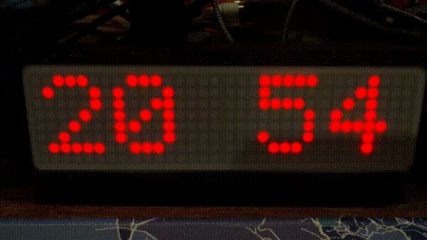

# LED Kurokku ESP

[](https://www.rust-lang.org/)
[](https://www.espressif.com/en/products/socs/esp32-c3)
[](#license)

Rust firmware for the [ESP32-C3](https://www.espressif.com/en/products/socs/esp32-c3) (RISC-V, built on `esp-idf-hal` / `esp-idf-svc`) that drives LED displays, fetching what to show from a server via HTTP polling. Think of it as a tiny networked sign you can control remotely — show the time, scroll messages, play animations, or push raw pixel data.

**Companion server:** [kurokku-esp-server](https://github.com/swilcox/kurokku-esp-server) — the instruction server this firmware polls. You'll want to run that (or implement the [server API](docs/server-api.md) yourself) to drive the device.

Sister project to [led-kurokku-go](https://github.com/swilcox/led-kurokku-go) (Raspberry Pi version).



## Supported Displays

| Display | Interface | Status |
|---------|-----------|--------|
| **MAX7219** — 32x8 LED matrix (4 daisy-chained 8x8 modules) | SPI | Implemented (demo above) |
| **TM1637** — 4-digit 7-segment | GPIO bit-bang | Implemented |

One display per device, selected at compile time via cargo feature flags
(`--features max7219` or `--features tm1637 --no-default-features`).

## Quick Start

If you just want to get up and running, here's the short version. See the [full setup guide](docs/setup.md) for detailed instructions.

```bash
# 1. Install prerequisites (see docs/setup.md for details)
# - Rust nightly toolchain (handled by rust-toolchain.toml)
# - ldproxy, espflash
# - just (command runner)
# - uv (for the provisioning tool)

# 2. Clone
git clone https://github.com/swilcox/led-kurokku-esp.git
cd led-kurokku-esp

# 3. Build and flash a generic firmware binary
just deploy

# 4. Provision this device's WiFi, server URL, etc. into NVS
cp tools/devices/example.yaml tools/devices/my-device.yaml
# ...edit my-device.yaml...
just provision my-device
```

Firmware binaries are generic — no WiFi credentials or device IDs are baked into the `.bin`. Per-device configuration lives in NVS and is provisioned separately with a small Python CLI, so a single signed OTA image is safe to distribute across every device on the fleet.

## Documentation

- **[Setup Guide](docs/setup.md)** — Everything you need from zero to a working device: software prerequisites, hardware shopping list, wiring, configuration, building, and flashing.
- **[Server API](docs/server-api.md)** — How to send instructions to the device (clock, messages, animations, raw pixels, OTA updates).

## How It Works

The firmware runs two threads:

- **Network thread** — polls your server for display instructions and updates shared state
- **Display thread** — renders widgets (clock, scrolling text, animations) and checks for new instructions between frames

If the server is unreachable, the device gracefully falls back to showing a clock. After ~5 minutes of consecutive failures, it reboots to re-establish connectivity.

### What Can It Display?

- **Clock** — 24h or 12h format with blinking colon
- **Messages** — static text (centered) or scrolling text (if wider than the display)
- **Animations** — TV static, Pong, Matrix rain
- **Raw pixels** — direct framebuffer control from the server
- **OTA updates** — the server can tell the device to update its own firmware

## Project Structure

```
src/
├── main.rs            # Startup sequence: display → WiFi → NTP → engine
├── config.rs          # NVS-backed configuration (provisioned via tools/provision.py)
├── engine.rs          # Two-thread display loop
├── wifi.rs            # WiFi connection + NTP sync
├── ota.rs             # Over-the-air firmware updates
├── font.rs            # 5x7 ASCII bitmap font
├── font_7seg.rs       # 7-segment character table + DP folding
├── framebuf.rs        # 32-byte column-major framebuffer
├── display/
│   ├── mod.rs         # Display/PixelDisplay/SegmentDisplay traits
│   ├── max7219.rs     # MAX7219 SPI driver
│   ├── tm1637.rs      # TM1637 bit-banged 2-wire driver
│   └── tm1637_proto.rs # Pure byte-encoding helpers (host-testable)
├── network/
│   ├── mod.rs         # InstructionSource trait + types
│   └── polling.rs     # HTTP polling implementation
└── widget/
    ├── mod.rs         # Widget trait + CancelToken
    ├── clock.rs       # Time display
    ├── message.rs     # Text display (static/scrolling)
    ├── animation.rs   # Visual animations
    ├── raw_render.rs  # Direct pixel/segment control
    └── status.rs      # IP address, errors, startup info
```

## Testing

Pure modules (font, font_7seg, framebuf, tm1637_proto) have unit tests that run
on the host — no ESP toolchain required:

```bash
just test
```

## License

MIT
